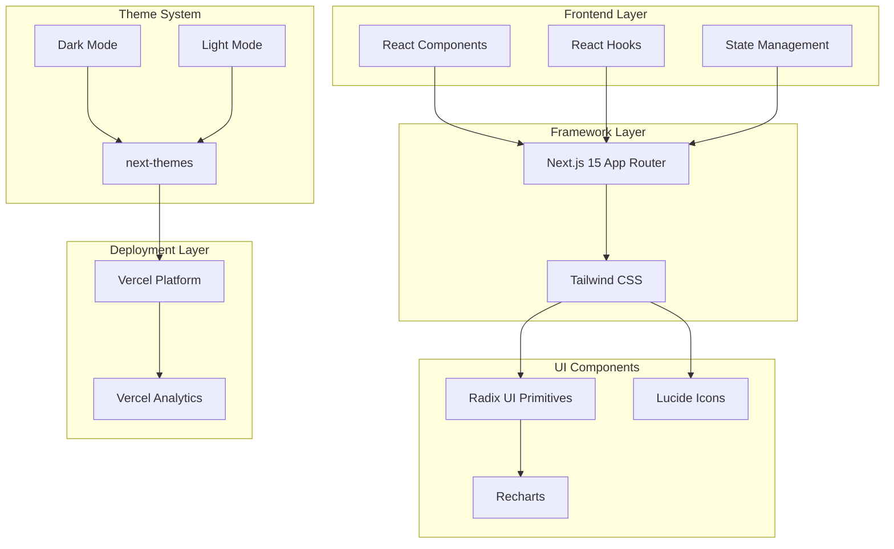

# Task Tracker

A modern task management application built with Next.js, featuring a clean UI with dark/light mode support, task categorization, and progress tracking.

[](https://vercel.com/gileb64375-5584s-projects/v0-task-tracker)
[](https://v0.app/chat/projects/rG7aHKnXP2o)
[](https://nextjs.org)
[](https://www.typescriptlang.org)

---

## System Architecture



---

## Features

### Core Features
- ✅ **Task Management** - Create, edit, and delete tasks with ease
- ✅ **Category Organization** - Organize tasks by categories (Work, Personal, etc.)
- ✅ **Progress Tracking** - Visual progress bars showing completion status
- ✅ **Dark/Light Mode** - Seamless theme switching with system preference detection
- ✅ **Responsive Design** - Fully responsive UI that works on all screen sizes
- ✅ **Task Filtering** - Filter tasks by status and category
- ✅ **Statistics Dashboard** - View task statistics and completion rates

### UI/UX Features
- 🎨 **Modern Design** - Clean, professional interface with subtle animations
- 🔔 **Toast Notifications** - User feedback for actions (sonner)
- 📊 **Data Visualization** - Charts for task statistics (recharts)
- ⌨️ **Keyboard Accessible** - Full keyboard navigation support
- ♿ **Accessible** - WCAG compliant components (Radix UI)

---

## Installation & Setup

### Prerequisites
- Node.js 18.x or higher
- pnpm (recommended) / npm / yarn

### Installation

```bash
# Clone the repository
git clone <repository-url>

# Navigate to project directory
cd task-tracker

# Install dependencies using pnpm (recommended)
pnpm install

# Or using npm
npm install

# Or using yarn
yarn install
```

### Development

```bash
# Start development server
pnpm dev

# Build for production
pnpm build

# Start production server
pnpm start

# Run linter
pnpm lint
```

The development server runs at `http://localhost:3000`

---

## Dev Stack

| Category | Technology |
|----------|------------|
| **Framework** | Next.js 15 (App Router) |
| **Language** | TypeScript 5.x |
| **Styling** | Tailwind CSS 3.4 |
| **UI Components** | Radix UI Primitives |
| **Icons** | Lucide React |
| **Forms** | React Hook Form + Zod |
| **Charts** | Recharts |
| **Notifications** | Sonner |
| **Theme** | next-themes |
| **Package Manager** | pnpm |
| **Deployment** | Vercel |
| **Analytics** | Vercel Analytics |

---

## Project Statistics

- **Total Dependencies**: 50+ packages
- **UI Components**: 30+ Radix UI components
- **Lines of Code**: ~5000+ (including dependencies)
- **Build Output**: Optimized production bundle

---

## Configuration Files

### next.config.mjs
- ESLint ignore during builds enabled
- TypeScript ignore build errors enabled
- Image optimization disabled (for static export compatibility)

### tailwind.config.ts
- Dark mode enabled via CSS class
- Custom color palette with CSS variables
- Custom animations for accordions
- Radix UI plugin integration

### tsconfig.json
- Strict TypeScript configuration
- Path aliases for clean imports

---

## Project Structure

```
task-tracker/
├── app/                    # Next.js App Router
│   ├── layout.tsx         # Root layout with theme provider
│   ├── page.tsx          # Main task tracker page
│   └── globals.css       # Global styles
├── components/            # React components
│   ├── ui/               # Reusable UI components
│   │   ├── button.tsx
│   │   ├── checkbox.tsx
│   │   ├── input.tsx
│   │   └── progress.tsx
│   └── theme-provider.tsx
├── lib/                   # Utility functions
│   └── utils.ts          # Tailwind merge utilities
├── public/               # Static assets
├── package.json          # Dependencies
├── next.config.mjs       # Next.js config
├── tailwind.config.ts    # Tailwind config
├── postcss.config.mjs   # PostCSS config
└── tsconfig.json         # TypeScript config
```

---

## Environment Variables

No environment variables required for local development. The app is configured to work out of the box.

For production on Vercel, the following are automatically configured:
- `VERCEL_ANALYTICS_ID` - Auto-configured by Vercel
- `NEXT_PUBLIC_*` - Public variables (if needed)

---

## Deployment

### Live URL
**[https://vercel.com/gileb64375-5584s-projects/v0-task-tracker](https://vercel.com/gileb64375-5584s-projects/v0-task-tracker)**

### Deploy to Vercel

1. Push your code to GitHub
2. Import project in Vercel
3. Vercel auto-detects Next.js and configures build settings
4. Deploys with automatic SSL and CDN

---

## How It Works

1. **Create/modify** your project using [v0.app](https://v0.app/chat/projects/rG7aHKnXP2o)
2. **Deploy** your chats from the v0 interface
3. **Changes** are automatically pushed to this repository
4. **Vercel** deploys the latest version with edge caching

---

## License

MIT License - Feel free to use this project for your own purposes.

---

## Contributing

Contributions are welcome! Please feel free to submit a Pull Request.

---

## Support

For issues or questions, please open a GitHub issue.